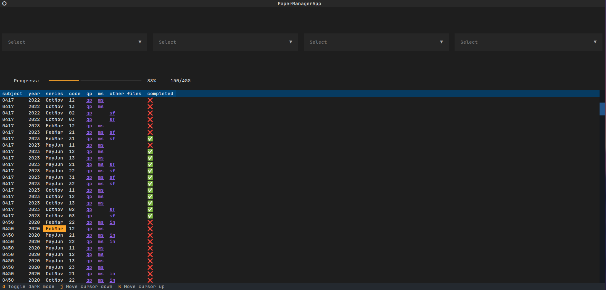

# Past Paper Manager

This project is made up of 2 scripts - `scrape.py` and `manager.py`. The first is used to scrape CAIE past papers from the [PapaCambridge](https://papacambridge.com) website, and the second is used to track my completion status.

